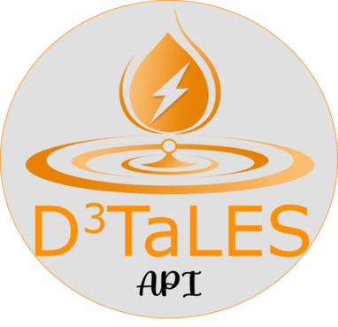

# D<sup>3</sup>TaLES API 



API designed for the [D<sup>3</sup>TaLES project](https://d3tales.as.uky.edu/). Includes 
data processing, database access functions, and property calculators. 

## [Website with full documentation for the D<sup>3</sup>TaLES API can be found here](https://d3tales.github.io/d3tales_api/).  

## Modules 
This API contains three modules: 
* `D3database`: Interface for interacting with the D<sup>3</sup>TaLES databases. Includes 
queries, data insertion with validation, and a REST API interface.
* `Processors`: Processing code for extracting data from computational and experimental
data files as well as [ExpFlow](https://d3tales.as.uky.edu/expflow) run objects. 
* `Calculators`: Property calculators and plotters for cyclic voltammetry
* `Workflows`: Fireworks workflow for the D<sup>3</sup>TaLES databases high throughput workflows 

## Installation 

### PIP Install
This module can be installed with pip install by running the following code: 

```bash
pip install git+https://github.com/d3tales/d3tales_api.git
```

>**Installation Notes**: 
> * If your python version is greater than 3.8, then you will need to install 
>[pymatgen](https://pymatgen.org/) directly into the environment you are working in. It is best to use 
>[conda](https://anaconda.org/conda-forge/pymatgen) for this.
> * If you plan to use any NLP parsers, you will need to install [ChemDataExtractor2](https://github.com/CambridgeMolecularEngineering/chemdataextractor2) 
> * with `pip install ChemDataExtractor2`. Dependency conflicts make it necessary to install separately.  

### Environment Variables
Note that many operation require a `DB_INFO_FILE` environment variable. This environment variable
should be a path to a JSON file containing connection information for the databases. The keys should 
be the database names such as `frontend`, `backend`, `expflow`, and `fireworks`. An example 
can be found at [db_info_ex.json](db_info_ex.json). 

To set this variable run:
```bash
export DB_INFO_FILE=$PWD/db_infos_ex.json
```

You can also set a `GROUP_FILE` environment variable. This should point to a json 
file containing source_group tag names. This is **optional**. 

To set this variable run:
```bash
export GROUP_FILE=$PWD/group_file_ex.json
```

REST API (`d3tales_api.restapi.RESTAPI`) will use `UPLOAD_USER` and `UPLOAD_PASS` environment 
variables if `username` and `password` arguments are not provided. These environment variables 
can be set in the same was as the `DB_INFO_FILE` variable. 

